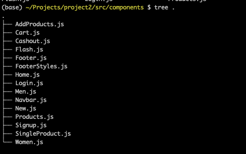
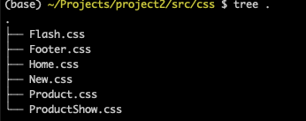
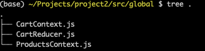
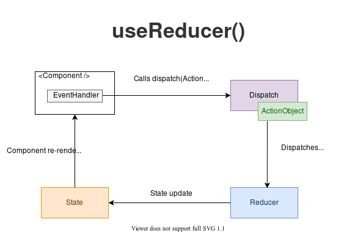

# Live site : https://wear-it.netlify.app/


# Getting Started with Create React App

This project was bootstrapped with [Create React App](https://github.com/facebook/create-react-app).

## Available Scripts

In the project directory, you can run:

### `npm start`

Runs the app in the development mode.\
Open [http://localhost:3000](http://localhost:3000) to view it in the browser.

The page will reload if you make edits.\
You will also see any lint errors in the console.

### `npm test`

Launches the test runner in the interactive watch mode.\
See the section about [running tests](https://facebook.github.io/create-react-app/docs/running-tests) for more information.

### `npm run build`

Builds the app for production to the `build` folder.\
It correctly bundles React in production mode and optimizes the build for the best performance.

The build is minified and the filenames include the hashes.\
Your app is ready to be deployed!

See the section about [deployment](https://facebook.github.io/create-react-app/docs/deployment) for more information.

### `npm run eject`

**Note: this is a one-way operation. Once you `eject`, you can’t go back!**

If you aren’t satisfied with the build tool and configuration choices, you can `eject` at any time. This command will remove the single build dependency from your project.

Instead, it will copy all the configuration files and the transitive dependencies (webpack, Babel, ESLint, etc) right into your project so you have full control over them. All of the commands except `eject` will still work, but they will point to the copied scripts so you can tweak them. At this point you’re on your own.

You don’t have to ever use `eject`. The curated feature set is suitable for small and middle deployments, and you shouldn’t feel obligated to use this feature. However we understand that this tool wouldn’t be useful if you couldn’t customize it when you are ready for it.


# Step 1: 

- Installing packages needed

1. npm install bootstrap

2. npm install firebase

3. npm install get-google-fonts

4. npm install react-icons-kit

5. npm i react-router-dom@5.2.0

6. npm install infinite-react-carousel –save

7. npm install @material-ui/core @material-ui/icons

8. npm install react-icons –save

9. npm install --save @fortawesome/fontawesome-free

10. npm install react-toastify

11. npm install --save styled-components







# Backend

-Then make a Config file to store the API key of the firebase to use it as a backend.
- Configure and import the firebase – authorisation, fire-store and storage to load the respective images and store the database items.

# Step 2:- 
## Navigation setup 

-	Setup the routes to the home page and signup and login 
-	Get the icons through various packages 
-	# Navbar
-	-> Put logo and signup and login 
-	-> import fonts and setup css files 
-	->import icons and load them
```
return (
        <div className='navbox'>
            <div className='leftside'>
            <a class="navbar-brand" href="/">Wear<span> This</span></a>
            </div>
            {!user && <div className='rightside'>
                <span><Link to="signup" className='navlink'>SIGN UP</Link></span>
                <span><Link to="login" className='navlink'>LOGIN</Link></span>
            </div>}
            {user && <div className='rightside'>
                <span><Link to="/" className='navlink'>{user}</Link></span>
                <span><Link to="cartproducts" className='navlink'><Icon icon={cart} /></Link></span>
                <span className='no-of-products'>{totalQty}</span>
                <span><button className='logout-btn' onClick={handleLogout}>Logout</button></span>
            </div>}
        </div>
    )
}
```
 
# Step 3:-
Add products to the database

# Step 4:- # Authentication

-- setup the folder structure and create a config file to link the firebase through api 


  ## Firebase Authentication

-> link the components to the navbar
-> then route them with react router

-> make a html form using bootstrap 

-> use react usestate hook for defining states 
-> on change handlers pull the target elements values
-> console the form and values to check the working condition

->import auth and db from config file
-> auth ---create users

## Db- store their information in database
	Use the guide below 
https://firebase.google.com/docs/auth/web/password-auth

-> createUserWithEmailAndPassword -> is firebase asyn function to create a user
```
const doSignup = (e) => {
    e.preventDefault();
    auth.createUserWithEmailAndPassword(email,password).then((cred)=>{
        db.collection('Users').doc(cred.user.uid).set({
          Name: name,
          Email: email,
          Password: password,
          ConfirmPassword: confirmpassword
        }).then(()=>{
          setName('');
          setEmail('');
          setPassword('');
          setConfirmPassword('');
          setError('');
          props.history.push('/login');
        }).catch(err=>setError(err.message));
    }).catch(err=>setError(err.message));
  }

```

// Asyn functions take sometime to complete. Asyn functions returns a promise which can be resolved or rejected 
// we use . then when we want something to happen if a promise is resolved and .catch if the promise is rejected.

// createUserWithEmailAndPassword-> returns a response and we can use that response in a callback function

// once the user is stored successfully then empty the states and move to the login component

https://firebase.google.com/docs/reference/node/firebase.database.DataSnapshot


# Step 5:- 

## Show the products

-import the database through config file and export to the products show page 

-Use create-Context and make js files in global folder to make it available to all the components


->React Context hook to use

It accepts a context object and returns the current context value for that context. 

-- Context provides a way to pass data through the component tree without having to pass props down manually at every level.

There are four steps to using React context:
1.	Create context using the createContext method.
2.	Take your created context and wrap the context provider around your component tree.
3.	Put any value you like on your context provider using the value prop.
4.	Read that value within any component by using the context consumer.

->Then in the products page 
//simple conditional and map function to show all the available products 
If we got products through map  to map each function and if we haven’t got any then through it as 0 and show some text.

->retrive the data from the firebase collection and show it on the webpage


# Step 6: Adding products into the cart 
// adding the products to the cart and display the total number of products in navbar

--- Throw an alert if the product is already there

for manipulating state, we use separate reducer files

A reducer is a function that determines changes to an application’s state. It uses the action it receives to determine this change. We have tools, like Redux, that help manage an application’s state changes in a single store so that they behave consistently.

useReducer
const [state, dispatch] = useReducer(reducer, initialArg, init);

An alternative to useState. Accepts a reducer of type (state, action) => newState, and returns the current state paired with a dispatch method. (If you’re familiar with Redux, you already know how this works.)

useReducer is usually preferable to useState when you have complex state logic that involves multiple sub-values or when the next state depends on the previous one. useReducer also lets you optimize performance for components that trigger deep updates because you can pass dispatch down instead of callbacks.


## Manipulation of state 
1.	Delete the cart items
2.	Increase and decrease the sizes

-> we use dispatch to pass an action to CartReducer to manipulate the state

On click at cart- dispatch function takes a type of the property; we can name it with any value. In addition, the product id of the product is passed 
```
import React, { createContext, useReducer } from 'react'
import { CartReducer } from './CartReducer'
// import the reducer

export const CartContext = createContext();

export const CartContextProvider = (props) => {

    const [cart, dispatch] = useReducer(CartReducer, { shoppingCart: [], totalPrice: 0, totalQty: 0 })
//will unpack it into the props on your component,  you "never" use {... props} inside your render() function,
// only when you pass the props down to another component. Use your unpacked props
// as normal this.props.x.
    return (
        <CartContext.Provider value={{ ...cart, dispatch }}>
            {props.children}
        </CartContext.Provider>
    )
}


```
```
The useReducer(reducer, initialState) hook accept 2 arguments: the reducer function and the initial state. The hook then returns an array of 2 items: the current state and the dispatch function.

-- The initial state is the value the state is initialized with.
-- An action object is an object that describes how to update the state.

--The dispatch is a special function that dispatches an action object.

const [state, dispatch] = useReducer(reducer, initialState);


```


```
As a result of an event handler or after completing a fetch request, 
you call the dispatch function with the action object.

Then React redirects the action object and the current state value to the reducer function.

The reducer function uses the action object and performs a state update, returning the new state.

React then checks whether the new state differs from the previous one.
If the state has been updated,
React re-renders the component and useReducer() returns the new state value: [newState, ...] = useReducer(...).
```

// cart reducer

- destructure the shoppingCart, totalPrice and totalQty
   -from state and then declare some variables

We use switch statement which has a case add to cart

In there-> we have a statement to check if the product is already there 
, if yes then return whatever the state we have 
If not then return the state with the new product

dispatch() is the method used to dispatch actions and trigger state changes to the store. 
# Step 7:- 
We move on to make a component to show each product indivdually


# Note:

## Big Thanks to Pat,Rowena and Joel for all their support
